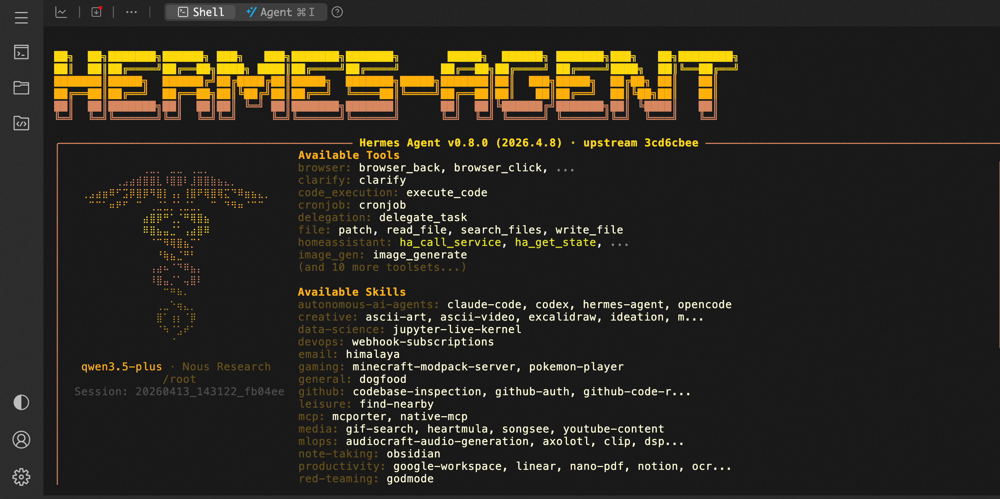

# 🤖 HermesAgent Service Overview

In April 2026, Nous Research proudly released **Hermes Agent** — a truly "alive" open-source AI agent.
Say goodbye to fragmented chatbots. Hermes Agent runs in your private environment, featuring persistent memory and self-evolving capabilities. It can autonomously create skills, learn from every interaction, and perfectly reuse experiences in future tasks.
Deploy once, evolve continuously. Hermes Agent understands you better with every use.

## 🚀 Deployment Process

1. Visit the ComputeNest HermesAgent Community Edition [deployment link](https://computenest.console.aliyun.com/service/instance/create/cn-hangzhou?type=user&ServiceId=service-279af6340fcd4f48bfe4) and fill in the deployment parameters as prompted:  

2. After configuring the parameters, the system will automatically generate a **cost estimate**. Confirm the details are correct and click **Next: Confirm Order**.

3. On the order confirmation page, verify the instance information and costs, then click **Create Now** to start the automatic deployment.

4. After deployment is complete, remotely connect to the ECS instance.

5. Execute commands to interact with HermesAgent.
    ```shell
    sudo su root
    hermes
    ```
    
    
## 📚 User Guide

For channel configuration, please refer to the HermesAgent [Official Documentation](https://hermes-agent.nousresearch.com/docs/user-guide/messaging/).
