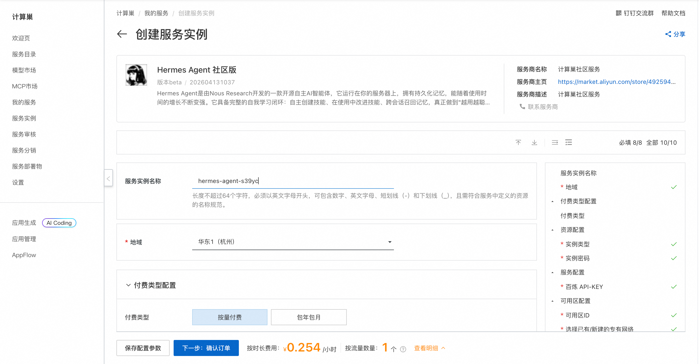
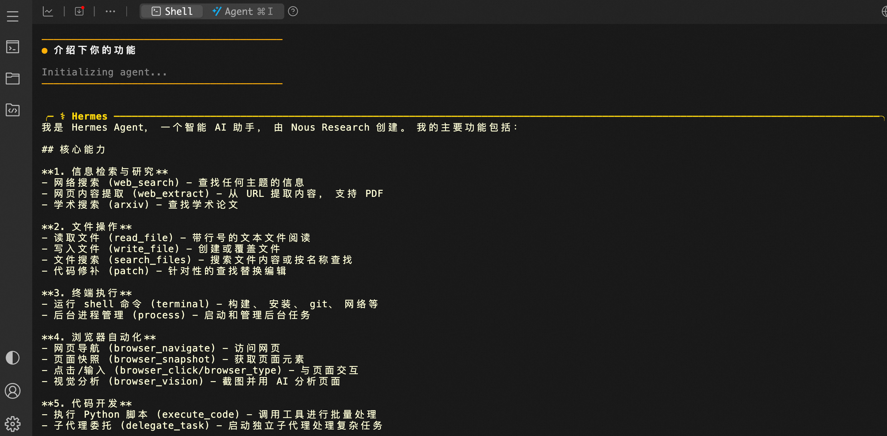

# 🤖 HermesAgent 服务简介

2026年4月，Nous Research 震撼发布 Hermes Agent —— 一款真正“活”着的开源智能体。
告别碎片化的聊天机器人，Hermes Agent 运行于你的私有环境，拥有持久记忆与自我进化能力。它能自主创建技能，从每次交互中学习，并在未来的任务中完美复用经验。
一次部署，持续进化。Hermes Agent，越用越懂你。

## 🚀 部署流程

1. 访问计算巢 HermesAgent 社区版 [部署链接](https://computenest.console.aliyun.com/service/instance/create/cn-hangzhou?type=user&ServiceId=service-279af6340fcd4f48bfe4)，按页面提示填写部署参数：  
    

2. 参数配置完成后，系统将自动生成**费用预估明细**。确认无误后点击 **下一步：确认订单**。

3. 在订单确认页，核对实例信息与费用，点击 **立即创建** 开始自动部署。

4. 部署完成后远程链接ECS。
    

5. 执行命令与HermesAgent进行交互。
    ```shell
    sudo su root
    hermes
    ```
    
    
    
## 📚 使用指南

配置频道请参考 HermesAgent [官方文档](https://hermes-agent.nousresearch.com/docs/user-guide/messaging/) 。

